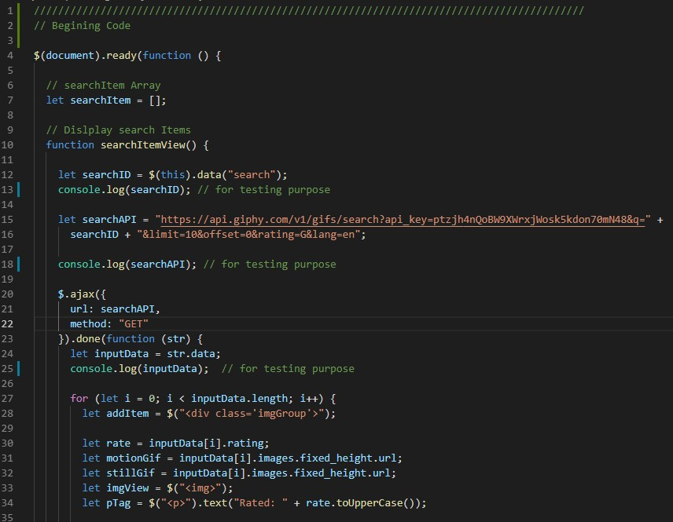
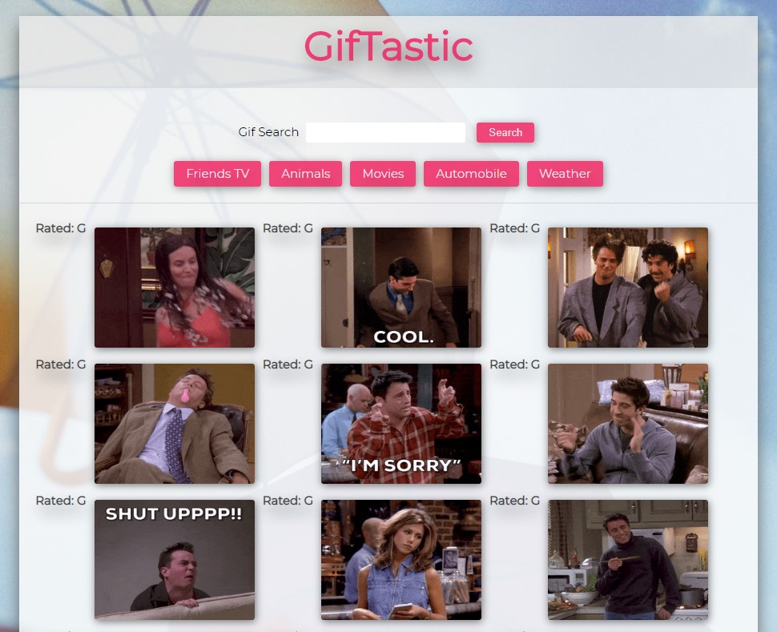
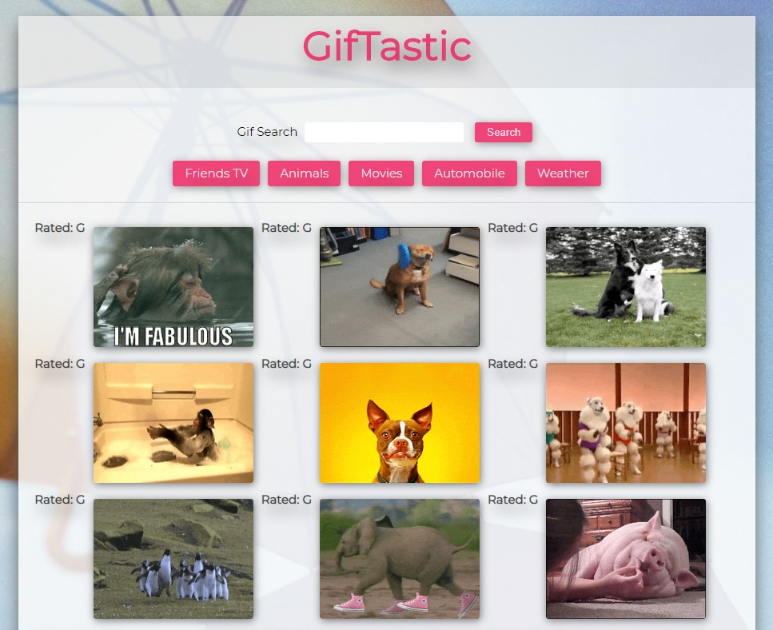

# GifTastic
Create a web page that populates with gifs using GIPHY API, Javascript, jQuery and HTML.

# Technology Used
HTML, CSS, Javascript, jQuery

## Start the app
[Click here to run](https://monksedo.github.io/GifTastic/)

## Code Snippets
### Javascript part 1 - 

### Javascript part 2 

## App Screenshots
### TV Show - Friends

### Animals

